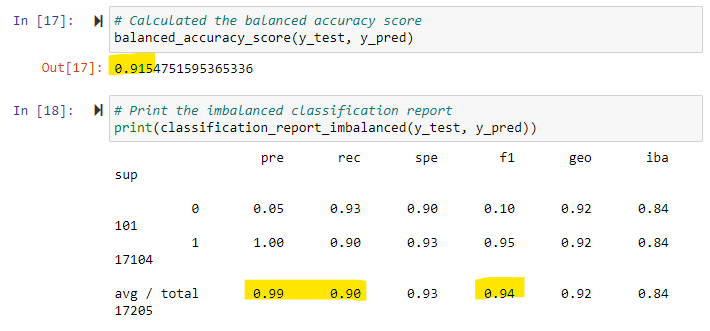

# Credit_Risk_Analysis

## Overview of the analysis: 
The purpose of this analysis is to create models that predict low_risk versus high_risk credit score applications by exploring different resampling methods for logistic regression.

## Results: 

 - Random Oversampling: Balanced_accuracy_score = .657, Precision = .99, Recall = .60

 - SMOTE Oversampling: Balanced_accuracy_score = .662, Precision = .99, Recall = .69 

 - Undersampling: Balanced_accuracy_score = .544, Precision = .99, Recall = .40

 - Combination (Over and Under) Sampling - SMOTEENN: Balanced_accuracy_score = .688, Precision = .99, Recall = .57

 - Balanced Random Forest Classifer: Balanced_accuracy_score = .955, Precision = .99, Recall = .91

 - Easy Ensemble AdaBoost Classifer: Balanced_accuracy_score = .955, Precision = .99, Recall = .91

## Summary: 
Below is a comparison for the accuracy, precision, and recall for all 6 models. It is evident that the the Balanced Random Forest Classifer and Easy Ensemble AdaBoost Classifer models did the best in each category, and therefore are recommended for this type of analysis.

#### Comparing Balanced Accuracy Scores for the different models. 
Undersampling did the worst with about 54.4%. Both methods over oversampling and the method of combination sampling landed in the 60%-70% range, which is a little better. However, the Balanced Random Forest Classifer and Easy Ensemble AdaBoost Classifer tie for first place here with 95.5%.

#### Comparing Precision for the different models
All 6 models received an precision score of 99%. 

#### Comparing Recall for the different models
The lowest recall score with 40% was undersampling. Combination did a little better with 57%. Random oversampling landed at 60%, while SMOTE oversampling had 69%. The best 2 methods for this category were the Balanced Random Forest Classifer and Easy Ensemble AdaBoost Classifer with 91% each.

