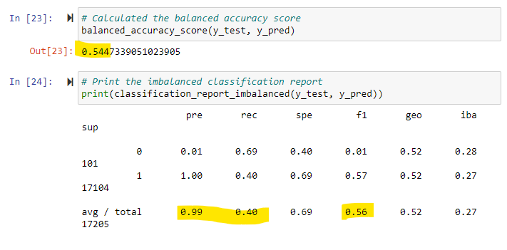
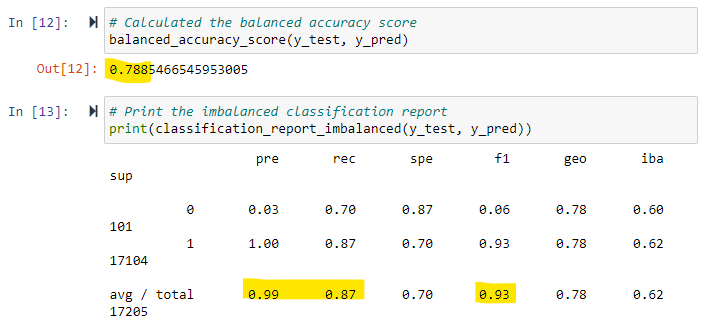

# Credit_Risk_Analysis

## Overview of the analysis: 
The purpose of this analysis is to create models that predict low_risk versus high_risk credit score applications by exploring different resampling methods for logistic regression.

## Results: 

 - Random Oversampling
 

 - SMOTE Oversampling

 - Undersampling

 - Combination (Over and Under) Sampling - SMOTEENN

 - Balanced Random Forest Classifer

 - Easy Ensemble AdaBoost Classifer

## Summary: 

Summarize the results of the machine learning models, and include a recommendation on the model to use, if any. If you do not recommend any of the models, justify your reasoning.

